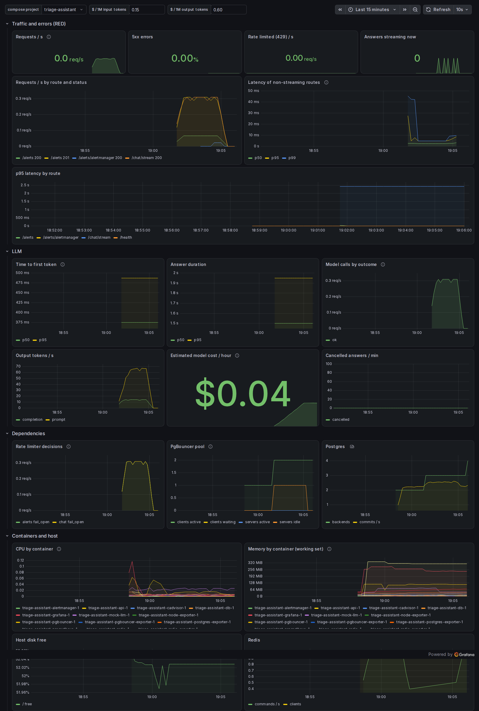

# Observability

How the system tells you what it is doing: metrics, dashboards, alerts
and logs, and the mistakes each one invites. ADR-0008 records the
choices; this chapter is how to work with them.

```
api (every worker) ──/metrics──┐
postgres-exporter ─────────────┤
pgbouncer-exporter ────────────┤   Prometheus ──rules──► Alertmanager ──webhook──► api: POST /alerts/alertmanager
redis-exporter ────────────────┼──► (scrape      │                                  (alerts appear in the app)
node-exporter (host) ──────────┤    every 15 s)  └──► Grafana (dashboard as code)
cAdvisor (containers) ─────────┤
mock-llm (the provider's view)─┘
```

`make obs-up` starts it next to the dev stack (`ENV=prod` next to the
production one). Grafana, Prometheus and Alertmanager listen on
127.0.0.1 only; on a server, reach them through an SSH tunnel.

## What is measured

| Signal | Metric | Why |
|---|---|---|
| **R**ate, **E**rrors | `http_requests_total{method, route, status}` | route = the template (`/alerts/{alert_id}`), never the raw path |
| **D**uration | `http_request_duration_seconds` (histogram, 5 ms – 10 s) | whole response; for a stream, the whole stream |
| saturation | `event_loop_lag_seconds` | how late the event loop runs a timer: the first sign of a busy or blocked worker (performance chapter) |
| saturation | `db_pool_connections_in_use` / `_max` | the app's database pools; stuck above 0 at idle = leaked connections (ADR-0010) |
| in flight | `http_requests_in_progress`, `llm_active_streams` | |
| the model | `llm_requests_total{outcome}`, `llm_time_to_first_token_seconds`, `llm_stream_duration_seconds`, `llm_tokens_total{kind}` | outcome is `ok`, `cancelled` (the user left) or an `llm_*` error code; tokens × price = cost |
| rate limiter | `ratelimit_decisions_total{scope, decision}` | `fail_open` = Valkey did not answer in time, request allowed |
| dependencies | `pg_up`, `pgbouncer_up`, `redis_up` + their exporters' metrics | |
| host / containers | node-exporter, cAdvisor (`container_*`, including `container_oom_events_total`) | CPU, memory, disk, OOM kills |

The four golden signals (latency, traffic, errors, saturation) are all
there. "Saturation" is the one teams forget. Here it is the event-loop
lag and the pool gauges, because an async worker saturates long before
its CPU graph looks full: the load tests saw timeouts at 46% CPU.

### Multiprocess mode

In production, gunicorn runs several worker *processes*. With a normal
Prometheus client, each scrape would be answered by whichever worker
got it. Measured with 4 workers and 40 requests, six scrapes returned
`15, 15, 5, 6, 14, 5`: each is one worker's share. In multiprocess mode
(`PROMETHEUS_MULTIPROC_DIR`), each worker writes its samples to files,
and `/metrics` sums them: `40, 40, 40, 40, 40, 40`. The costs:
- There are no per-process CPU or memory metrics (cAdvisor provides
  those per container).
- Every gauge needs a `multiprocess_mode` (`livesum`, `max`...).
- The client calls `getpid()` on every metric update (visible in
  `strace`: ~8 per request).
- The directory must exist before the first import, and must never be
  set to an empty string.

### Labels

Each distinct combination of label values is a separate time series,
held in Prometheus' memory. Values must come from a small, fixed set:
- route **templates**, never raw paths
- outcomes and error codes, never messages
- never user ids, IPs or free text

A test asserts that a request to `/alerts/424242` is recorded as
`/alerts/{alert_id}`. cAdvisor by default turns every container label
into a Prometheus label. `--store_container_labels=false` plus a
whitelist of the two compose labels keeps it bounded.

## Dashboards are code

`infra/observability/grafana/build_dashboard.py` generates
`dashboards/service.json`, which Grafana provisions at startup. Change
the Python, run `make dashboard`, and review the JSON diff in the PR.
`make obs-check` fails if the committed JSON is not what the generator
produces. An edit made in the Grafana UI survives only until the next
reload.



What the first version of the dashboard got wrong: 4 of its 30 queries
showed "No data" on a healthy system.
- **A ratio whose numerator does not exist yet.** Until the first 5xx
  happens, `http_requests_total{status=~"5.."}` has no series, and a
  division by a missing series is "no data", not 0. Write `(… or
  vector(0))`.
- **`rate()` needs two samples.** Just after a restart it returns
  nothing, so a panel goes blank for one scrape interval.
- **A new series' first increment is invisible to `rate()` and
  `increase()`.** They need a previous sample, so an alert on "any 5xx"
  can miss the very first one.
- **One outlier route flattens a latency panel.** `/chat/stream` lasts as
  long as the answer (seconds), so it's excluded from the p95-by-route
  panel and has its own LLM row.

## Alerts

18 rules in `infra/observability/prometheus/alerts.yml`. Each alert says
what users experience ("more than 5% of api requests fail"), not only
which component is unhappy. `for:` is how long the condition must hold,
so a blip pages nobody. Severity maps onto the app's alert severities.

| Alert | Fires when | For |
|---|---|---|
| `ApiDown` / `ApiMissing` | the api can't be scraped / there is no api at all | 1 min |
| `PostgresDown`, `PgBouncerDown` | the exporter can't reach it | 1 min |
| `RedisDown` | Valkey is down: rate limiting is off | 1 min |
| `ExporterDown` | a monitoring exporter is down (blind spot) | 5 min |
| `HighErrorRate` | > 5% of requests are 5xx | 5 min |
| `SlowRequests` | p95 of non-streaming routes > 1 s | 10 min |
| `EventLoopLagHigh` | loop lag p95 > 100 ms | 5 min |
| `RateLimiterFailingOpen` | requests pass unlimited | 2 min |
| `DatabasePoolSaturated` | clients queue in PgBouncer | 2 min |
| `AppDatabasePoolExhausted` | the api's pools are > 90% in use | 2 min |
| `LLMErrors` | > 10% of model calls fail | 5 min |
| `LLMSlowFirstToken` | p95 time to first token > 10 s | 10 min |
| `DiskWillFillIn6h`, `DiskAlmostFull` | the trend says full in 6 h / < 10% free | 15 / 5 min |
| `ContainerNearMemoryLimit`, `ContainerOOMKilled` | > 90% of the limit / the kernel killed a process | 5 min / at once |

**Alert rules are code with tests.** `alerts.test.yml` feeds synthetic
series to `promtool test rules` and asserts when each alert must and must
not fire. It has 7 test cases, covering 8 of the 18 rules. `make
obs-check` runs them, as does CI. A test that expects the wrong thing
fails with the exact difference, so they are real tests.

**`absent()` for things that vanish.** When a service is removed rather
than stopped, its `up` series disappears, and `up == 0` can never be
true. `ApiMissing` uses `absent(up{job="api"})` (✅ covered by a promtool
test).

**How fast it notices** (✅ measured end to end, Valkey stopped):
- `RedisDown` firing after 90 s (a 15 s scrape, plus 1 min `for:`, plus
  evaluation);
- in the app 30 s later (Alertmanager's `group_wait`).

That's about 2 minutes from failure to notification, and faults shorter
than a scrape interval can leave no trace at all (failure-modes chapter).

**Alertmanager** sends alerts to the app itself (`POST
/alerts/alertmanager`, bearer token, compared in constant time), so a
demo shows its own alerts. Its config file can't read environment
variables, so the token arrives as a compose secret file. For a real
team, add a receiver (email, Slack, a pager) in `alertmanager.yml`.

## Logs

One JSON object per line on stdout from every service (the api's
format: `ts`, `level`, `logger`, `msg`, `request_id`, plus fields).
Docker keeps them, rotated at 3 × 10 MB per container. The request id
joins nginx and the api (debugging chapter). Log levels:
- `info`: one line per request (`app.access`) and lifecycle events.
- `warning`: a degradation that is handled (the limiter failing open).
- `error`: something failed for a user, with a traceback.

What not to log: request bodies, alert text and chat questions (personal
data), secrets, tokens. The chatty `httpx2` logger (one line per model
call) is set to WARNING.

## Not here yet 📘

- **Tracing** (OpenTelemetry). The request id answers "what happened to
  this request" on one host. Traces become worth their cost once a
  request crosses several services, or when you need a timing breakdown
  inside one request in production.
- **Central log storage** (Loki, CloudWatch Logs, ELK). Docker's
  rotation keeps about a day of busy logs. Ship them off the host before
  you need last week's.
- **Outside-in checks.** Nothing notices when the whole VM or nginx is
  down, and nothing notices when Prometheus itself stops. Add an external
  uptime check on `/healthz`, and an always-firing "dead man's switch"
  alert that an external service expects to keep receiving.
- **SLOs.** From the measurements, reasonable starting objectives:
  - 99.5% of non-streaming requests under 250 ms (measured p95 ~2 ms at
    500 req/s);
  - 99% of answers starting within 5 s (TTFT is the provider's time plus
    ours);
  - 99.9% availability per month.

  Alert on the error budget's burn rate instead of fixed thresholds.
