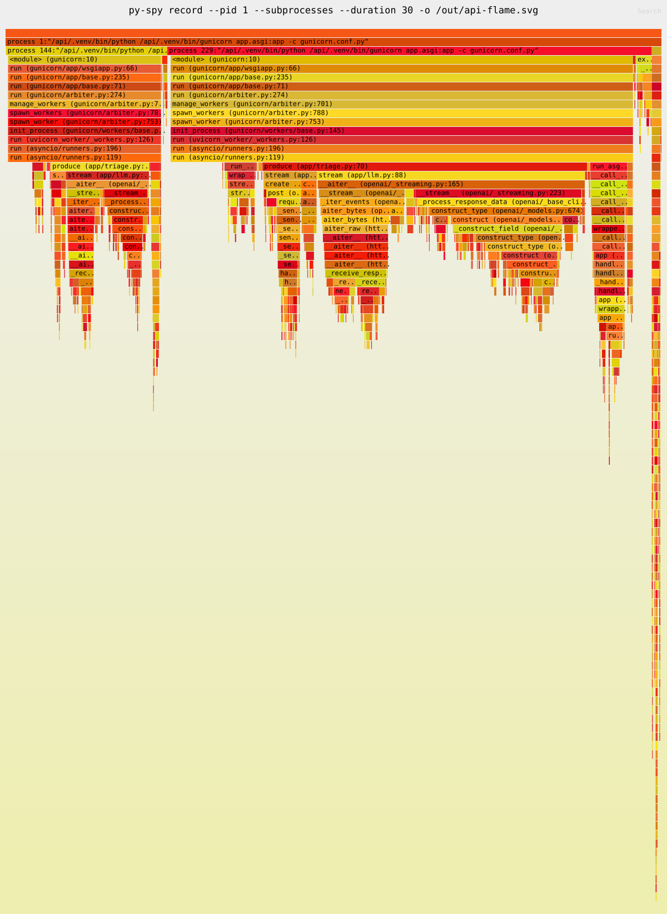

# Performance: finding and fixing bottlenecks

How performance was measured here, what the bottlenecks were, the
numbers before and after each fix, and the method to repeat it. Load
tools are compared in the load-testing chapter; ADR-0009 records the
settings that came out of this.

✅ Everything here was measured on this repo's box:
- the production-shaped stack (`make prod-up`), 2 api workers with 2 CPUs;
- 2 million seeded alerts;
- load generated through nginx by k6 on the same host. Same-host means
  the load generator competes for CPU, so treat absolute numbers as
  this box's, and the ratios as the lesson.

## The method

1. **A question with a number in it.** "Can we serve 500 alert reads per
   second at p95 < 50 ms?", not "is it fast?".
2. **Realistic data.** `make seed n=2000000 ENV=prod`. The first
   bottleneck (below) was invisible with a few thousand rows.
3. **An open-model load.** Requests arrive at a fixed *rate* whether or
   not earlier ones have finished, as users do. A closed model (N users
   waiting for each response) slows down when the system does, and hides
   the queue (the load-testing chapter has the numbers).
4. **Watch all four signals together:** request rate, errors, latency
   percentiles, and saturation. Saturation is the event-loop lag, CPU
   per container, and the database pools.
5. **Find the bottleneck with the right tool.** Database time:
   `make db-top-queries` then `EXPLAIN (ANALYZE, BUFFERS)`. api CPU:
   `make py-spy-record`. A blocked worker: `make py-spy-dump`.
6. **Change one thing, measure again, keep the numbers.** Every fix
   below has a before and an after under the same load.

## Bottleneck 1: a missing index

**Symptom.** At only 20 iterations/s (40 req/s) of the dashboard's two
alert queries:
- p95 7 s, and 45% of requests failed;
- k6 had to start 157 virtual users to keep the arrival rate, which
  shows the queue building;
- the api's errors were `TimeoutError` from the connection pool (5 s)
  and nginx returned 503s. Every connection was busy with a slow query.

**Finding it.** `make db-top-queries` showed two queries with a mean of
1.5–1.7 s under load. `EXPLAIN (ANALYZE, BUFFERS)` showed each one as a
parallel sequential scan of 2 M rows, reading ~30,000 buffers (~235 MB)
per query. **Run on an idle database, the same `EXPLAIN` said 43 ms and
152 ms**, which looks harmless. An idle `EXPLAIN` is not a load test: 40
copies at once, all scanning the whole table, is a different workload.

**The fix, and the choice.**

| Index | Newest first | By severity | Size | Insert cost (200 k rows) |
|---|---|---|---|---|
| none | 152 ms | 43 ms | — | 244 ms |
| `(created_at, id)` | **0.125 ms** (index scan backward, 54 buffers) | 3.8 ms | 60 MB | 369 ms (+51%) |
| + `(severity, created_at, id)` | 0.125 ms | 0.063 ms | +78 MB | 726 ms (2 indexes) |

One index shipped. It meets the target 50× over, and the second index
would double the write cost for a query that is already fast. It is
documented with the trigger for adding it (the severity query showing up
in `SlowRequests`). Built with `CREATE INDEX CONCURRENTLY` (749 ms on
2 M rows) so writes were never blocked.

**After, same load:** p95 4.07 ms / 1.6 ms, 0% failed.

## How much it serves

**Reads** (`GET /api/alerts?limit=50` through nginx):

| Offered | Achieved | p95 | api CPU | Postgres CPU |
|---|---|---|---|---|
| 500 req/s | 500 | 1.4–1.9 ms | 0.5 core | 0.19 core |
| 1,000 req/s | 1,000 | 173 ms (p50 8 ms) | 1.0 core | |
| 2,000 req/s | 1,710 | 1.78 s (p99 3 s) | 2.0 cores (the limit) | 0.93 core |

So about 500 simple reads/s per api core, with the knee near 1,000 req/s
on 2 workers. The ceiling is api CPU, not the database. More capacity
means more CPUs or replicas; a faster database would not help.

**Streaming answers** (mock model at 50 tokens/s, ~49 tokens per
answer):

| Concurrent streams | First event p95 | Answer p95 | Failed | Answers/s | api CPU |
|---|---|---|---|---|---|
| 50 | 114 ms | 1.45 s | 0% | 37 | 0.37 core |
| 200 | 435 ms | 1.82 s | 1.14% | 126 | 0.92 core |
| 500 | 2.45 s | 3.89 s | 0.59% | 213 | 1.85 cores |
| 500, after the fixes below | 1.25 s | 3.05 s | **0%** | **239** | 2 cores (saturated) |

## Bottleneck 2: a saturation cascade

At 200–500 streams, errors came from everywhere at once:
- nginx: 57 `recv() failed (104: Connection reset by peer)`;
- the api: 2,042 rate-limiter fail-opens, 407 "too many Redis
  connections", 68 database pool timeouts.

Each had its own cause, and they amplified each other:

| Cause | Why | Fix |
|---|---|---|
| gunicorn recycled workers every ~10,000 requests (`max_requests`) | a recycling worker closes keep-alive connections that nginx is about to reuse; nginx doesn't retry a POST on a reset connection, so the user gets a 502 | recycling off: it guarded against a leak nobody had measured |
| the rate limiter's 50 ms budget expired | the budget is wall-clock time: it includes the time Valkey's reply waits for a busy event loop to read it | 200 ms budget |
| the Redis pool (64 per worker) ran out | more concurrent requests than connections | 256 |
| database pool timeouts | see bottleneck 3 | pool 20, overflow 0 |

After: 0 errors in 10,056 answers, 239 answers/s, 0 connection resets.
The general lesson: **on a busy event loop, every timeout measured in
wall-clock time fires early**. The first symptoms of CPU saturation were
fail-opens and pool timeouts at 46% CPU, not slow responses. That's why
`event_loop_lag_seconds` exists, with an alert on it.

## Bottleneck 3: connection churn (a metastable state)

Locust showed ~90 ms per request where k6 showed 2 ms, at the same rate.
- pgbouncer counted 196 new logins in 20 s under Locust, against 6 under
  k6. Each login is a SCRAM handshake: p50 12.6 ms.
- SQLAlchemy *discards* overflow connections when they are returned.
  Irregular arrivals pushed the pool into overflow, the discarded
  connections had to be recreated, and that made requests slower.
- Slower requests kept concurrency high, which kept the pool in
  overflow.

A system stuck in a slow state by its own slowness is metastable: it
stays there after the trigger is gone. Fix: a fixed pool with no
overflow (20 per worker). Logins dropped from 196 to 5, and Locust's
p50 from 97 to 35 ms.

The remaining ~30 ms was not a bug: it was the **shape** of Locust's
load. Its users send in clumps. k6 driven with the same clumped shape
(100 users × 1 request/s) measured 29.4 ms, and latency scaled with the
per-request cost. A burst of N simultaneous requests on one worker makes
the last one wait for the other N−1. The same average rate with a
different arrival shape is a different workload. The loop-lag metric
(sampled every 250 ms) under-samples 50 ms bursts, so this is also where
it stops being a precise instrument.

## Where the CPU goes: profiling streaming

`make py-spy-record` at 300 concurrent streams (2,276 samples, workers
57% busy):

```
openai SDK          40.1%    starlette/fastapi   4.5%
httpx2 / httpcore2  21.9%    our code            2.5%
asyncio loop        18.2%    sqlalchemy          2.2%
pydantic             5.0%    SSE json + logging  2.5%
```



**Reading a flame graph:** each box is a function, and its *width* is
the share of samples in which it was on the stack. Wide boxes are where
time goes. Height is only call depth. Look for wide plateaus near the
top: functions that spend time themselves rather than calling others.

The suspects, measured one at a time:
- `json.loads` of a chunk: 1.6 µs.
- The SDK's pydantic validation of it: 4.0 µs.

Neither is the bottleneck. End to end per chunk, the SDK's client side
costs **126 µs** against **55 µs** for the raw HTTP client plus
`json.loads`. About 12,500 chunks/s × 126 µs ≈ 1.6 cores, which matches
the saturation.

**Decision: keep the SDK** (ADR-0009). Dropping it would roughly double
streams per core, but we'd own the provider protocol, and a real
provider's quota binds long before 500 concurrent streams.

## What a blocked event loop looks like

A lab copy of the chat code called a *synchronous* HTTP client inside
the async stream (never committed):
- `/health`, which does no I/O, went from 1.2 ms to up to 4.8 s with 20
  streams.
- Answers fell to 1.57/s with 20 users (the correct code: 37/s with 50).
- `ruff --select ASYNC,B,S` said "All checks passed!": linters don't know
  which SDK clients block.

How each tool showed it:
- **py-spy dump:** the worker's main thread sitting in
  `read (httpcore2/_backends/sync.py:127)`.
- **asyncio debug mode:** `Executing <Task ...> took 1.3 seconds`, 60
  times.
- **gunicorn:** with the provider stalled for 35 s (beyond the 30 s
  `timeout`), `WORKER TIMEOUT`, then the workers killed. The result: 2
  × 502, and 2 answers cut off.

## Startup and memory

- **Import time is 734 ms** per worker (`python -X importtime`):
  FastAPI 207 ms, the openai SDK 175 ms. Every deploy, scale-out and
  replacement of a crashed worker pays it.
- **Memory per request:** no growth, measured with tracemalloc over 1,000
  and 4,000 requests (`scripts/debug/memory_growth.py`). The debugging
  chapter shows how to read it, and the two mistakes that made the first
  version report a false leak.

## Checklist for the next investigation

- [ ] A target with a number, and seeded data at production volume
- [ ] An open-model load (k6 `constant-arrival-rate`), a warm-up, then a
      steady state long enough to see the p99
- [ ] The dashboard open: rate, errors, p95/p99, loop lag, pools, CPU
      per container
- [ ] The load generator's own CPU checked: a saturated generator
      measures itself
- [ ] `make db-top-queries` reset before (`pg_stat_statements_reset()`)
      and read after
- [ ] `make py-spy-record` during the steady state, if the api's CPU is
      the limit
- [ ] One change at a time; before and after numbers in the PR; an ADR
      if it changes a default
